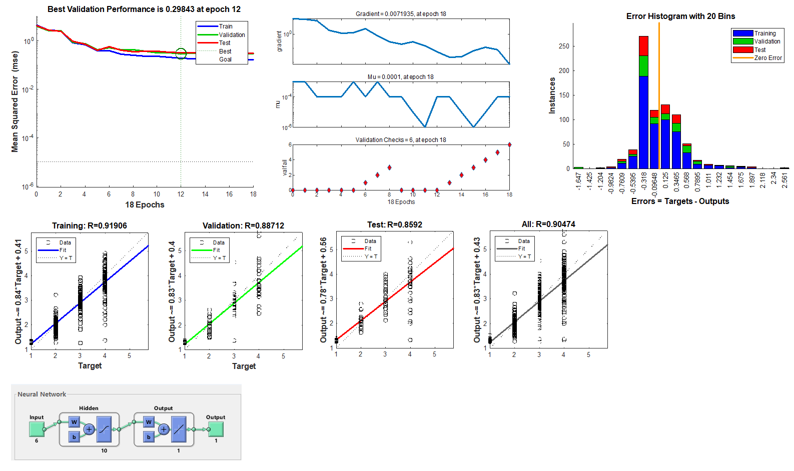
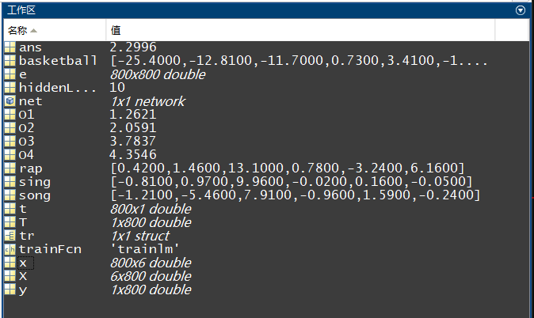

# 简介
使用ANN模型来识别纯鹿人是不是IKUN。主要原理就是简单模拟四个基本动作，丢给ANN模型去识别。
## 唱
静止状态下为唱
## 跳
MPU6050水平上下摇晃
## RAP
MPU6050水平左右摇晃
## 篮球
MPU6050全方位摇晃

## 训练结果



## 验证结果
一共四组测试数据：
```matlab
sing = [-0.81, 0.97, 9.96, -0.02, 0.16, -0.05];
song = [-1.21, -5.46, 7.91, -0.96, 1.59, -0.24];
rap = [0.42, 1.46, 13.1, 0.78, -3.24, 6.16];
basketball = [-25.4, -12.81, -11.7, 0.73, 3.41, -1.12];
```
